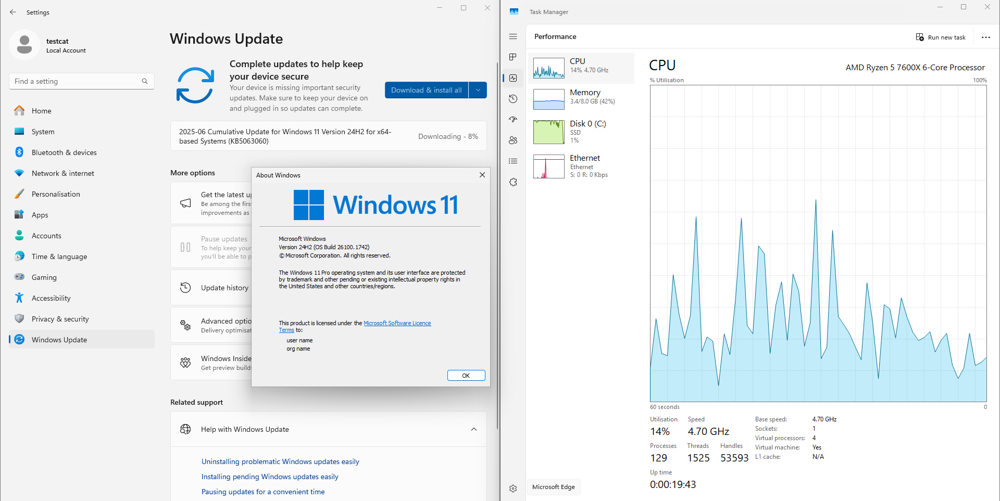
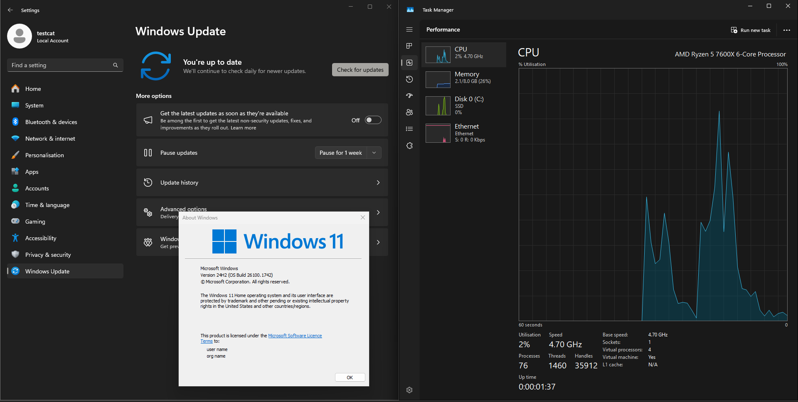

# <p align="center">Basilisk - Windows 11 Debloating Utility </p>

<p align="center">
  
</p>

<p align="center">
  <strong>A comprehensive Windows 11 debloating utility that automates the process of removing bloatware, optimizing system settings, and configuring a clean Windows environment in just a single click.</strong>
</p>

<p align="center">
  <a href="#-features">Features</a> •
  <a href="#-system-requirements">Requirements</a> •
  <a href="#-installation--usage">Installation</a> •
  <a href="#before--after-performance-comparison">Before & After</a> •
  <a href="#-contributing">Contributing</a>
</p>

---

## ⚠️ Important Notice

> **Basilisk is designed to be used on freshly installed Windows 11 systems.** Using Basilisk on an already in-use system, or any older versions of Windows, is not guaranteed to work and can cause some apps to stop working properly and system corruption!

> **You must disable Real-time Protection, Tamper Protection & add a C:/ drive exclusion in windows security before running basilisk.**

## ✨ Features

- 🚀 **Automated Debloating** - Removes Windows bloatware and unnecessary applications
- ⚡ **System Optimization** - Applies registry tweaks for better performance
- 🌐 **Network Optimization Tweaks** - Disables Delivery Optimization, tunes TCP/IP, and improves network performance
- 🛡️ **Telemetry & Tracking Blocker** - Blocks known Microsoft telemetry and ad servers at the hosts file level
- 💾 **SSD & Hardware-Specific Optimizations** - Detects SSDs, enables TRIM, disables scheduled defrag, and applies hardware-specific tweaks
- 🔧 **Update Policy Configuration** - Configures Windows Update policies based on your edition
- 🎨 **Custom Desktop Background** - Sets a custom desktop wallpaper
- 🖥️ **User-Friendly Interface** - Simple GUI with progress tracking
- 📝 **Comprehensive Logging** - Detailed logging for troubleshooting
- 🛡️ **Safety First** - Creates system restore points before modifications
- 🪟 **Automated App Installation** - Installs essential apps (Brave, .NET, DirectX, etc.) directly using winget with admin rights
- 🖌️ **Start Menu & Accent Color Tweaks** - Disables "Show recently added apps" and "Show recommended files" in Start Menu, enables accent color

## 📋 System Requirements

- **Operating System**: Windows 11 Home or Professional (fresh pro installation recommended)
- **Architecture**: x64
- **Python**: 3.12.4 or greater (for development)
- **Administrator Privileges**: Required for system modifications
- **Internet Connection**: Required for downloading scripts and system optimization

## 🚀 Installation & Usage

### Quick Start (One-Liner)

Run Basilisk directly from GitHub with a single command:

```powershell
iex (irm https://raw.githubusercontent.com/ctrlcat0x/basilisk/master/run.ps1)
```

**This command will automatically:**
- Configure Windows Defender settings
- Download the latest Basilisk executable
- Launch Basilisk with administrator privileges

### Pre-built Binary (Recommended)

1. Download the latest version from [GitHub Releases](https://github.com/ctrlcat0x/basilisk/releases)
2. Temporarily whitelist your C: drive in Windows Defender
3. **Run as Administrator**

### Building from Source

#### Prerequisites
```bash
# Install Python 3.12.4 or greater
# Install required dependencies
pip install -r requirements.txt
```

#### Build Process
```bash
# Run the build script
build.bat
```

The build process uses Nuitka to create a standalone executable with PyQt5 GUI framework and all dependencies bundled.

### Command Line Options

```bash
# Developer mode (no installation overlay)
python basilisk.py --developer-mode

# Skip specific steps
python basilisk.py --skip-download-scripts-step
python basilisk.py --skip-registry-tweaks-step
python basilisk.py --skip-configure-updates-step
# ... etc for all 7 steps
```

## 🖼️ Before & After: Performance Comparison

Basilisk delivers measurable improvements to system performance by removing bloatware, disabling unnecessary services, and optimizing system settings. Below is a real-world before-and-after comparison on a fresh Windows 11 installation:

<p align="center">
  
  
</p>
<p align="center">
  <b>Left: Before running Basilisk<br>Right: After running Basilisk</b>
</p>

**Test environment:**

- VirtualBox
- Windows 11 24H2 downloaded from microsoft.com
- 8GB RAM at 5200MT/s
- 2 cores assigned from an AMD 7600X
- 60GB HDD for install

### Performance Metrics

| Metric                | Before Basilisk     | After Basilisk      |
|-----------------------|---------------------|---------------------|
| Memory Usage (Idle)   | 3-4 GB              | 1.5-2.5 GB          |
| CPU Usage (Idle)      | 10-20%              | 0-5%                |
| Disk Space (System)   | 20-30 GB            | 15-20 GB            |
| Background Processes  | 120-150             | 70-75               |
| Telemetry/Tracking    | Enabled             | Disabled            |
| UWP Apps              | Pre-installed       | Removed             |
| Privacy Settings      | Default             | Hardened            |

**Note:** Actual results may vary depending on hardware, Windows build, and selected options. The above values are based on real-world tests with default Basilisk settings on a clean Windows 11 Pro VM.

## 📦 Automatically Installed Applications

Basilisk installs the following apps directly using winget (with admin rights):
- Brave Browser as we remove Microsoft Edge.
- Microsoft.DotNet.DesktopRuntime.8 [Windows Dependency]
- Microsoft.DotNet.DesktopRuntime.9 [Windows Dependency]
- Microsoft.VCRedist.2015+.x86 [Windows Dependency]
- Microsoft.VCRedist.2015+.x64 [Windows Dependency]
- Microsoft.EdgeWebView2Runtime [Windows Dependency]
- Microsoft.DirectX [Windows Dependency]

## 🏗️ Architecture Overview

Basilisk follows a modular 8-step debloating process:

1. **📥 Download Scripts** - Downloads PowerShell scripts from Github servers
2. **🦅 Execute Scripts** - Runs custom scripts for Edge removal and Office Online cleanup
3. **🔧 Execute External Scripts** - Runs ChrisTitusTech WinUtil and Raphi's Win11Debloat
4. **⚙️ Registry Tweaks** - Applies visual and performance registry modifications
5. **🚀 Advanced Optimizations** - Enables Ultimate Performance, disables telemetry, removes UWP apps
6. **🔄 Configure Updates** - Sets appropriate update policies for your Windows edition
7. **🎨 Apply Background** - Sets custom desktop wallpaper and cleans up temporary files

## 🛡️ Safety & Compatibility

### Safety Measures
- ✅ **Pre-installation Checks** - Validates system compatibility
- ✅ **Restore Point** - System restore point created before any changes
- ✅ **Error Handling** - Comprehensive error catching and user feedback
- ✅ **Logging** - Detailed logs for troubleshooting
- ✅ **Rollback Protection** - Safe registry modifications

### Compatibility
- **Windows 11 Home/Pro** - Primary target
- **Fresh Installations** - Recommended for best results
- **Administrator Rights** - Required for system modifications

## 📁 Project Structure

```
basilisk/
├── basilisk.py                 # Main application entry point
├── debloat_components/         # 7-step debloating process
├── ui_components/              # GUI components and styling
├── utilities/                  # Core utility functions
├── screens/                    # UI screens and overlays
├── scripts/                    # PowerShell scripts
├── configs/                    # Configuration files
├── media/                      # Assets (backgrounds, icons, fonts)
└── preinstall_components/      # Pre-installation checks
```

## 🔧 Technical Details

### PowerShell Scripts Used
- **ChrisTitusTech WinUtil** - Comprehensive Windows optimization
- **Raphi Win11Debloat** - Additional debloating and customization
- **Custom Scripts** - Edge removal and Office Online cleanup

### Advanced Optimizations
- **Network Tweaks**: Disables Windows Delivery Optimization, tunes TCP/IP stack, disables NetBIOS, and optimizes network adapter settings for better speed and lower background usage.
- **Telemetry & Tracking Blocker**: Updates the Windows hosts file to block a curated list of Microsoft telemetry and ad servers, reducing unwanted data collection.
- **SSD & Hardware-Specific Optimizations**: Detects SSDs, enables TRIM, disables scheduled defrag, disables Superfetch, and applies other hardware-specific performance tweaks.
- **Start Menu Tweaks**: Disables "Show recently added apps" and "Show recommended files" for a cleaner, more private Start Menu experience.
- **Accent Color Tweaks**: Enables accent color on Start, taskbar, title bars, and window borders, and sets the accent color to the darkest possible value (black) for a sleek look.

### Registry Modifications
- Taskbar alignment (left-aligned)
- Dark theme enforcement
- Game DVR disable
- Menu animation optimizations
- File extension visibility
- UI hover time adjustments
- Start Menu
- Accent Color

### System Optimization
- **Restore Point** - Basilisk creates a system restore point before any changes
- **Comprehensive Debloat** - Uses multiple tools for thorough optimization
- **UWP App Removal** - Directly removes pre-installed UWP apps
- **Temp File Cleanup** - Cleans up temporary files and system cache after completion

## 📝 Logging

Basilisk provides comprehensive logging for troubleshooting:
- **File Location**: `%TEMP%\basilisk\` directory
- **Log Levels**: DEBUG, INFO, WARNING, ERROR
- **Content**: Step-by-step execution details and error information

## 🤝 Contributing

We welcome contributions from the community! Here's how you can help:

### Development Setup
1. Clone the repository
2. Install dependencies: `pip install -r requirements.txt`
3. Run in development mode: `python basilisk.py --developer-mode`

### Code Structure
- **Modular Design** - Each component is self-contained
- **Error Handling** - Comprehensive exception management
- **Type Hints** - Python type annotations for better code quality
- **Documentation** - Inline comments and docstrings

### Core External Tools & Scripts
**The project would never have been possible without the extensive research and work done by these developers of windows optimization software which serves as the core of basilisk.**
- [Talon by Raven Development Team](https://github.com/ravendevteam/talon)
- [ChrisTitusTech](https://github.com/christitustech) - [CTT WinUtil](https://github.com/christitustech/winutil)
- [Raphire](https://github.com/Raphire) - [Win11Debloat](https://github.com/Raphire/Win11Debloat)
- [Massgrave Activation Script](https://github.com/massgravel/Microsoft-Activation-Scripts)

## 📄 License

**Anyone and everyone is free to use or modify the project as long as there is no monetary benefits from it.**

## ⚠️ Disclaimer

This tool modifies system settings and registry values. While designed to be safe, it's recommended to:
- Use on fresh Windows 11 installations
- Basilisk automatically creates a system restore point before use
- Test in a virtual environment first
- Understand that some modifications may affect system functionality

The developers are not responsible for any data loss or system issues that may occur from using this tool.

---

<p align="center">
  <strong>Made with ❤️ by ctrlcat0x</strong>
</p> 
